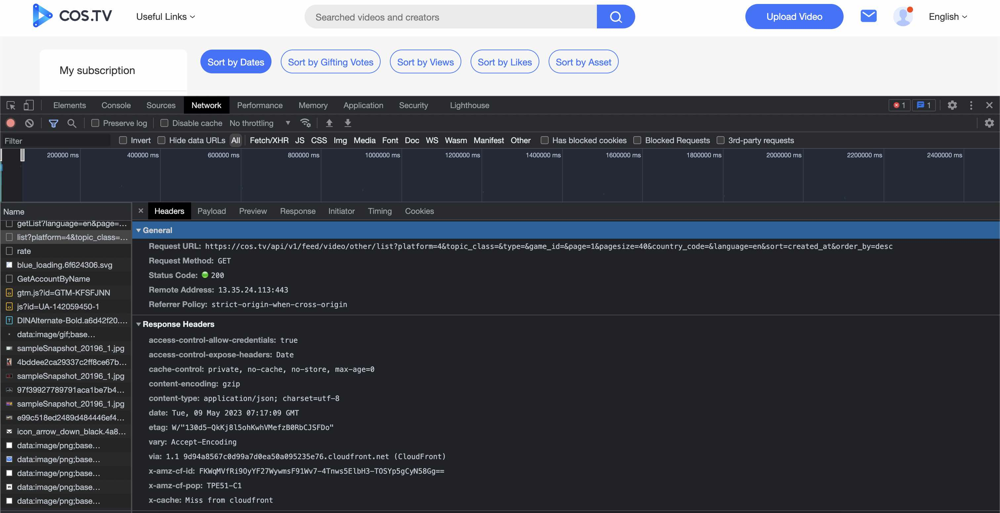

# COSTV Retrieval Plugin

## Introduction

Provide an API server for searching [COS.TV](https://cos.tv) video data by [Chatgpt-Retrieval-Plugin](https://github.com/openai/chatgpt-retrieval-plugin)

Some modification as following:

| Directory                     | Description                                                                                                                |
| ----------------------------- | -------------------------------------------------------------------------------------------------------------------------- |
| [`models`](/models)           | Adjusts the fields of the data model to fit the video data from cos.tv                                         |
| [`scripts`](/scripts)         | Offers scripts for processing the video json data from cos.tv                                   |
| [`services`](/services)       | Adjusts the metadata extraction to fit the video data from cos.tv                                 |
&nbsp;
&nbsp;
## Video Data Source

Refer to the [recommend video page](https://cos.tv/videos/list/recommended) of COS.TV.


&nbsp;
&nbsp;
## Setup

This app uses Python 3.10, and [poetry](https://python-poetry.org/) for dependency management.

Install Python 3.10 on your machine if it isn't already installed. It can be downloaded from the official [Python website](https://www.python.org/downloads/) or with a package manager like `brew` or `apt`, depending on your system.

Clone the repository from GitHub:

```
git clone https://github.com/openai/chatgpt-retrieval-plugin.git
```

Navigate to the cloned repository directory:

```
cd /path/to/chatgpt-retrieval-plugin
```

Install poetry:

```
pip install poetry
```

Create a new virtual environment that uses Python 3.10:

```
poetry env use python3.10
poetry shell
```

Install app dependencies using poetry:

```
poetry install
```
&nbsp;
&nbsp;
## General Environment Variables
The API requires the following environment variables to work:

| Name             | Required | Description                                                                                                                                                                                |
| ---------------- | -------- | ------------------------------------------------------------------------------------------------------------------------------------------------------------------------------------------ |
| `DATASTORE`      | Yes      | This project only supports `pinecone` so far.|
| `BEARER_TOKEN`   | Yes      | This is a secret token that you need to authenticate your requests to the API. You can generate one using any tool or method you prefer, such as [jwt.io](https://jwt.io/).                |
| `OPENAI_API_KEY` | Yes      | This is your OpenAI API key that you need to generate embeddings using the `text-embedding-ada-002` model. You can get an API key by creating an account on [OpenAI](https://openai.com/). |

&nbsp;
&nbsp;
## API Endpoint Deployment
Replace the configuration in Dockerfile and run stateless web apps using Docker containers in any serverless platform(like Google Cloud Run)